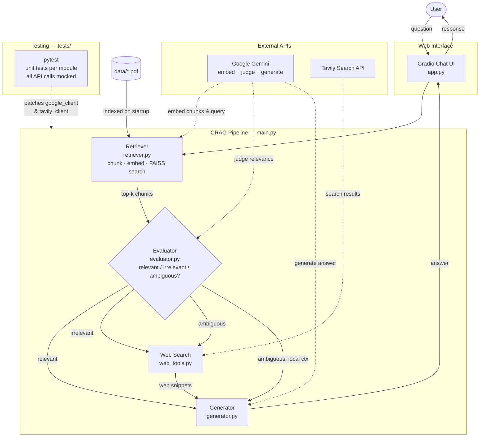

# Applied AI System — Ask Craig (CRAG Pipeline)

A Corrective RAG (CRAG) chatbot that answers questions from local PDFs and falls back to live web search when local documents are insufficient. It matters because standard RAG systems generate confident answers even when their retrieved context is irrelevant — Ask Craig adds an AI judge that detects this and reroutes to the web, so answers are always grounded in something real.

## Original project

> **Project name:** [YOUR ORIGINAL PROJECT NAME]

[2–3 sentences: what your original project did, what its goals and capabilities were, and what limitation this current project fixes.]

## System diagram



> You can also paste the block above into [mermaid.live](https://mermaid.live) to view and edit it interactively.

The diagram has four main components. The **Retriever** splits PDFs into overlapping text chunks, embeds them with Gemini, and stores them in a FAISS vector index for fast similarity search. The **Evaluator** asks Gemini to read the retrieved chunks and return a single verdict — `relevant`, `irrelevant`, or `ambiguous` — which controls where the answer comes from. The **Web Search** module calls Tavily when local documents aren't sufficient. The **Generator** receives whichever context won the routing decision and produces the final answer. All of this is orchestrated by `main.py`, which also ensures the PDF index is built exactly once per session.

## How it works

1. User asks a question via the Gradio chat UI.
2. The system retrieves the most relevant chunks from indexed local PDFs.
3. A Gemini model judges whether the retrieved context is `relevant`, `irrelevant`, or `ambiguous`.
4. Depending on the verdict:
   - **Relevant** → answer from local documents only.
   - **Irrelevant** → answer from Tavily web search.
   - **Ambiguous** → answer from both sources combined.

## Sample interactions

These three examples show each routing path the pipeline can take.

**Example 1 — Relevant: answered directly from local PDFs**

> **Input:** "What is the main argument made in the uploaded paper?"
>
> **Evaluator verdict:** `relevant`
>
> **Output:** "Based on the document, the main argument is that transformer-based architectures outperform recurrent models on long-range dependency tasks because attention mechanisms can directly relate any two positions in a sequence regardless of distance. The paper supports this with experiments on three NLP benchmarks showing a 12–18% improvement in BLEU score over LSTM baselines. *(Source: local documents)*"

---

**Example 2 — Irrelevant: answered from web search**

> **Input:** "What were the top AI breakthroughs in 2025?"
>
> **Evaluator verdict:** `irrelevant` — no uploaded PDF covers 2025 events.
>
> **Output:** "According to current web sources, major 2025 AI developments include advances in mixture-of-experts scaling, multimodal reasoning models, and significant reductions in inference cost for large language models. Several frontier labs published technical reports showing reasoning benchmark improvements exceeding prior state-of-the-art by wide margins. *(Source: web search)*"

---

**Example 3 — Ambiguous: local context supplemented by web**

> **Input:** "How does FAISS compare to other vector databases for production use?"
>
> **Evaluator verdict:** `ambiguous` — the PDF mentioned FAISS briefly but didn't compare alternatives.
>
> **Output:** "Your document notes that FAISS is well-suited for in-memory nearest-neighbor search at small-to-medium scale. Supplementing with web sources: compared to managed databases like Pinecone or Weaviate, FAISS offers lower latency and no network overhead since it runs in-process, but lacks persistence, distributed scaling, and metadata filtering. For production workloads with millions of vectors, managed solutions typically add operational value that raw FAISS can't provide. *(Source: local documents + web search)*"

## Setup

### 1. Clone the repo and enter the directory

```bash
git clone <repo-url>
cd Applied-AI-System
```

### 2. Create a virtual environment and install dependencies

```bash
python -m venv .venv
source .venv/bin/activate        # Windows: .venv\Scripts\activate
pip install -r requirements.txt
```

### 3. Configure API keys

Copy `.env.example` to `.env` and fill in your keys:

```bash
cp .env.example .env
```

| Key | Where to get it |
|-----|-----------------|
| `GEMINI_API_KEY` | [Google AI Studio](https://aistudio.google.com/app/apikey) |
| `TAVILY_API_KEY` | [Tavily](https://app.tavily.com/) |

### 4. Add your PDFs

Place any PDF files you want to query in the `data/` folder:

```
data/
  your-document.pdf
  another-file.pdf
```

If the folder is empty the system will skip local retrieval and fall back to web search for every query.

### 5. Run the app

```bash
python app.py
```

Open the URL printed in the terminal (default: `http://127.0.0.1:7860`).

To run without the UI (terminal only):

```bash
python -m src.main
```

## Project structure

```
app.py              # Gradio web interface entry point
src/
  clients.py        # API client setup (Gemini, Tavily)
  retriever.py      # PDF loading, chunking, embedding, FAISS index
  evaluator.py      # Relevance scoring via Gemini
  generator.py      # Final answer generation via Gemini
  web_tools.py      # Tavily web search fallback
  main.py           # CRAG pipeline orchestration
data/               # Place your PDF files here
requirements.txt
.env.example        # Copy to .env and add your keys
```

## Design decisions

**Why add an evaluator instead of always using web search?**
Always falling back to the web would ignore documents the user explicitly uploaded. Always trusting the local index would produce hallucinations when the question falls outside those documents. The evaluator makes the routing decision intelligently with a small added latency cost — one extra Gemini call per query.

**Why FAISS instead of a managed vector database?**
FAISS runs entirely in-process with no infrastructure setup. Anyone can clone the repo, install requirements, and run it immediately. The trade-off is that the index lives in memory and is rebuilt on every startup. For a production system with thousands of documents, a persistent store like Chroma or Pinecone would be worth the added complexity.

**Why Gemini for both embedding and generation?**
Using one provider for all AI calls simplifies key management and keeps the dependency surface small — one free-tier API key covers embedding, judging, and generating. The trade-off is vendor lock-in; swapping models requires changes in three separate files.

**Why Gradio for the UI?**
Gradio's `ChatInterface` gives a functional, shareable chat UI in ~10 lines of code and handles conversation history and example prompts without any frontend work. The trade-off is limited customization — advanced layouts or branding would require a full frontend framework.

**Why split the pipeline into five separate files?**
Each module has one job, so each can be tested in isolation with mocked dependencies. The trade-off is more files to navigate initially, but it pays off when debugging: a failing test immediately points to exactly which stage of the pipeline broke.

## Running the tests

```bash
# from the project root, with your venv active
pytest tests/ -v
```

No API keys or PDF files are needed — every external call is mocked. The suite covers:

| File | What is tested |
|------|---------------|
| `tests/test_retriever.py` | Text chunking, empty-index guard, PDF indexing, corrupt-PDF skip |
| `tests/test_evaluator.py` | All three verdicts, unexpected model output, API failure fallback |
| `tests/test_generator.py` | Normal answer, source label in prompt, API failure message |
| `tests/test_web_tools.py` | Result formatting, empty results, API failure |
| `tests/test_main.py` | Empty query, relevant/irrelevant/ambiguous routing, empty-web fallback, unhandled exception |

**What worked well:** Mocking at the module level (`@patch("src.evaluator.google_client")`) made tests fast and fully deterministic — no real API calls, no flakiness, no keys required. Testing pure functions like `_chunk_text` required no mocking at all. The `conftest.py` approach of patching SDK constructors before any `src.*` import cleanly solved the problem of `clients.py` validating keys at import time.

**What was tricky:** Getting the `conftest.py` import order right took iteration — `os.environ` must be set and the SDK constructors must be patched *before* any test file imports a `src.*` module, otherwise the real clients try to initialize. Also, `sys.path` had to be explicitly set because pytest doesn't automatically treat the project root as importable.

**What isn't tested:** The Gradio UI layer is not covered — verifying the chat interface renders correctly requires a browser. End-to-end integration tests with live API calls are also absent; the mock-based unit tests verify logic but not that the APIs return usable responses in practice.

## Reflection

**Limitations and biases**
The system's quality is only as good as the PDFs you give it. If those documents are outdated, one-sided, or written from a particular cultural or disciplinary perspective, the answers will reflect that without any warning to the user. The web search fallback introduces a different kind of bias: Tavily returns results ranked by its own relevance algorithm, so the system may consistently favor certain publishers or perspectives without the user knowing. There is also a language limitation — the embedding model and generation model both perform best in English, so multilingual documents or queries may return lower-quality results. Finally, the `ambiguous` routing path blends local and web context by simply concatenating them, with no mechanism to resolve contradictions between the two sources.

**Potential for misuse**
The most direct misuse would be pointing the system at documents containing misinformation and asking it to produce authoritative-sounding summaries of those claims. Because the system is designed to answer from what it retrieves, it will faithfully reproduce harmful content if that content is in the index. A second risk is using the web search fallback to automate large volumes of queries against Tavily at low cost, which could violate the API's terms of service. To mitigate these risks, a deployed version should add input and output filtering (content moderation before generation), rate limiting per user, and a clear disclaimer that answers should be verified before acting on them.

**What surprised me during reliability testing**
The evaluator's `ambiguous` verdict turned out to be much more common than expected. Questions that seemed clearly answerable from the uploaded documents were frequently classified as ambiguous because the relevant information was spread across multiple chunks rather than concentrated in one. This meant the system often triggered a web search unnecessarily, adding latency and sometimes pulling in web results that contradicted the document. It revealed that the chunk size and the top-k retrieval count are more important tuning parameters than they initially appeared.

**Collaboration with AI during this project**
AI assistance was used throughout this project for code structure, error handling, and the test suite.

One instance where it was genuinely helpful: when setting up the pytest mocking strategy, AI suggested patching the client objects at the module level where they are *used* (e.g. `@patch("src.evaluator.google_client")`) rather than at the source where they are defined. This is the correct approach in Python because `patch` replaces the name in the namespace that imports it, not the original definition. Without that guidance, the mocks would not have intercepted the actual calls.

One instance where its suggestion was flawed: AI initially generated `conftest.py` without the `sys.path.insert` line needed to make `src` importable. Every test failed with `ModuleNotFoundError: No module named 'src'` because pytest does not automatically add the project root to the Python path when tests live in a subdirectory. The fix was straightforward once the error was clear, but the omission meant the tests could not run at all until that line was added — a good reminder to always run generated code before trusting it.

## Logging

The app logs to stdout at `INFO` level. Each pipeline stage (indexing, retrieval, relevance verdict, generation) emits a log line so you can trace what happened for any given query.
